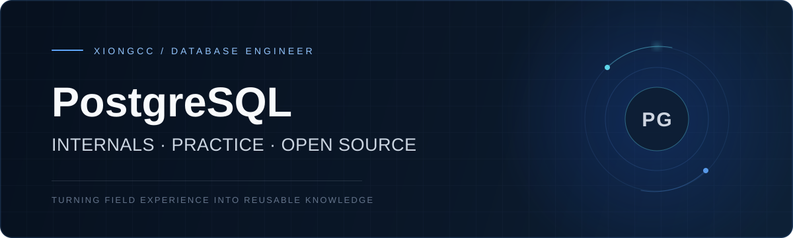

  

  <a href="https://xiongcc.cn">Website</a>&nbsp;&nbsp;·&nbsp;&nbsp;
  <a href="https://xiongcc.cn">Writing</a>&nbsp;&nbsp;·&nbsp;&nbsp;
  <a href="https://postgres-internals.cn/">Book</a>&nbsp;&nbsp;·&nbsp;&nbsp;
  <a href="mailto:xiongcc_1994@126.com">Email</a>

  POSTGRESQL ACE / MVP&nbsp;&nbsp;&nbsp;·&nbsp;&nbsp;&nbsp;100+ ARTICLES&nbsp;&nbsp;&nbsp;·&nbsp;&nbsp;&nbsp;OPEN SOURCE MAINTAINER

## About

I'm a PostgreSQL and Greenplum engineer, open-source enthusiast, and technical writer. I focus on database internals, production practices, and data infrastructure in the AI era.

My work is centered on one thing: turning complex database mechanisms and field experience into knowledge, tools, and projects that others can actually use.

## Selected Work

<table>
  <tr>
    <td width="50%" valign="top">
      BOOK · DATABASE INTERNALS
      <h3>《PostgreSQL 内参》</h3>
      
《PostgreSQL 14 Internals》中文版。系统梳理 PostgreSQL 的内部工作机制，沉淀为可长期阅读的中文资料。

      <a href="https://postgres-internals.cn/">Read the book →</a>
    </td>
    <td width="50%" valign="top">
      KNOWLEDGE · OPEN SOURCE
      <h3>PostgreSQL 中文 HowTo</h3>
      
围绕真实使用场景整理的中文实践手册，让分散的 PostgreSQL 经验变得可查询、可复用。

      <a href="https://postgres-howto.cn/">Explore the handbook →</a>
    </td>
  </tr>
  <tr>
    <td width="50%" valign="top">
      DBA · FIELD NOTES
      <h3>PostgreSQL DBA Daily 5.0</h3>
      
把日常巡检、故障排查、性能优化和生产实践，整理成一张持续演进的 DBA 知识图谱。

      <a href="https://xiongcc.cn/about/">Learn more →</a>
    </td>
    <td width="50%" valign="top">
      COURSE · ENGINEERING
      <h3>PostgreSQL 入门到进阶实战</h3>
      
面向 AI 时代数据基础设施的系统课程，从基础概念走向真实工程实践。

      <a href="https://coding.imooc.com/class/1009.html">View the course →</a>
    </td>
  </tr>
</table>

## Open Source

<table>
  <tr>
    <td width="50%" valign="top">
      <h3><a href="https://github.com/xiongcccc/pg-mastery">pg-mastery</a></h3>
      
PostgreSQL internals, DBA practice, performance tuning, troubleshooting, and real-world production cases.

      CURATED KNOWLEDGE BASE
    </td>
    <td width="50%" valign="top">
      <h3><a href="https://github.com/xiongcccc/pgcheck">pgcheck</a></h3>
      
A lightweight PostgreSQL health-check CLI built for DBAs, SREs, and database engineers.

      DATABASE HEALTH CHECK
    </td>
  </tr>
  <tr>
    <td width="50%" valign="top">
      <h3><a href="https://github.com/xiongcccc/postgres-howto">postgres-howto</a></h3>
      
Practical PostgreSQL how-tos in Chinese, collected and maintained as reusable field knowledge.

      CHINESE HOW-TO LIBRARY
    </td>
    <td width="50%" valign="top">
      <h3><a href="https://github.com/xiongcccc/pg-slide-harvester">pg-slide-harvester</a></h3>
      
A lightweight tool for collecting PostgreSQL conference slides into a searchable local archive.

      CONFERENCE ARCHIVE TOOL
    </td>
  </tr>
</table>

## Latest Writing

<!-- BLOG-POST-LIST:START -->
- 2026-09-07 · [PostgreSQL 的 2026 与下一个十年](https://xiongcc.cn/2026/09/07/PostgreSQL%20%E7%9A%84%202026%20%E4%B8%8E%E4%B8%8B%E4%B8%80%E4%B8%AA%E5%8D%81%E5%B9%B4/)
- 2026-08-14 · [当答案不再稀缺，DBA 真正稀缺的是什么？](https://xiongcc.cn/2026/08/14/%E5%BD%93%E7%AD%94%E6%A1%88%E4%B8%8D%E5%86%8D%E7%A8%80%E7%BC%BA%EF%BC%8CDBA%20%E7%9C%9F%E6%AD%A3%E7%A8%80%E7%BC%BA%E7%9A%84%E6%98%AF%E4%BB%80%E4%B9%88%EF%BC%9F/)
- 2026-07-23 · [AI 时代首选数据库：PostgreSQL 入门到进阶实战](https://xiongcc.cn/2026/07/23/AI%20%E6%97%B6%E4%BB%A3%E9%A6%96%E9%80%89%E6%95%B0%E6%8D%AE%E5%BA%93%EF%BC%9APostgreSQL%20%E5%85%A5%E9%97%A8%E5%88%B0%E8%BF%9B%E9%98%B6%E5%AE%9E%E6%88%98/)
- 2026-07-23 · [pg-slide-harvester：自动收集 PG 大会演讲资料](https://xiongcc.cn/2026/07/23/pg-slide-harvester%EF%BC%9A%E8%87%AA%E5%8A%A8%E6%94%B6%E9%9B%86%20PG%20%E5%A4%A7%E4%BC%9A%E6%BC%94%E8%AE%B2%E8%B5%84%E6%96%99/)
- 2026-07-06 · [从数据库到后端底座：HigoBase 想讲一个什么新故事？](https://xiongcc.cn/2026/07/06/%E4%BB%8E%E6%95%B0%E6%8D%AE%E5%BA%93%E5%88%B0%E5%90%8E%E7%AB%AF%E5%BA%95%E5%BA%A7%EF%BC%9AHigoBase%20%E6%83%B3%E8%AE%B2%E4%B8%80%E4%B8%AA%E4%BB%80%E4%B9%88%E6%96%B0%E6%95%85%E4%BA%8B%EF%BC%9F/)
<!-- BLOG-POST-LIST:END -->

Updated daily from <a href="https://xiongcc.cn">xiongcc.cn</a>

---

  <i>If you are working on PostgreSQL, Greenplum, or database internals, let's talk.</i>  
  <a href="https://xiongcc.cn">xiongcc.cn</a>&nbsp;&nbsp;·&nbsp;&nbsp;
  PostgreSQL 学徒&nbsp;&nbsp;·&nbsp;&nbsp;
  <a href="mailto:xiongcc_1994@126.com">xiongcc_1994@126.com</a>

